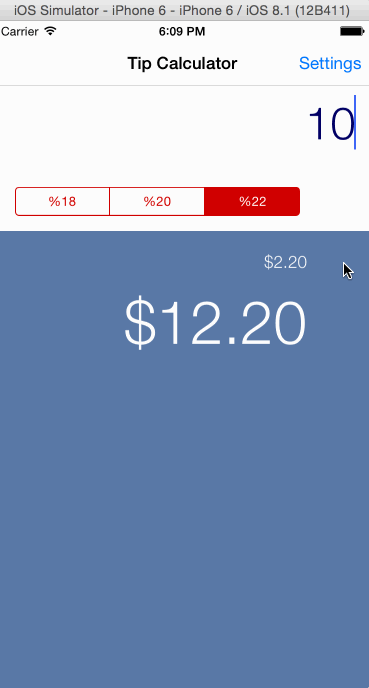

# tip-calculator

Project Description:
This is an iOS demo application to calculate a tip percentage. For
Codepath's Stanford iOS application.

Note that this app is based off of the Swift version here: https://vimeo.com/102084767 even though it is written in Objective C. I have had a little bit of Objective C experience and am in a crunch for finals so I looked and the demo and built off of there. Also, from the reading I've done it looks like it pays to be competent in both languages for iOS devlopment.

I'm looking forward to hopefully having a chance to dive into Swift!

Time spent: 3 hours spent in total

Completed user stories:
- Basic calculator
- Animations
- Basic settings

Walkthrough of user stories:

GIF created with [LiceCap](http://www.cockos.com/licecap/).
